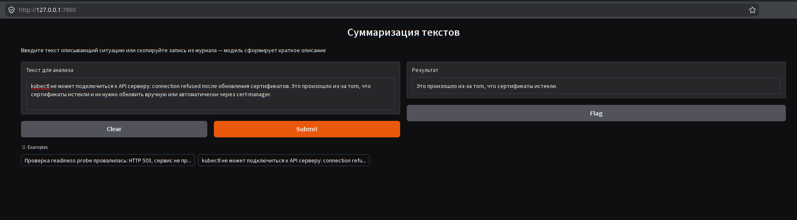

# Домашнее задание
https://u.netology.ru/backend/uploads/lms/content_assets/file/14979/1-block-05-opensource-huggingface-homework.pdf
---
# Решение

## Подготовим среду для работы с HF
- Регистраци на HF и получение токена
  - Cайт [huggingface.co](https://huggingface.co/join) - Sign Up. Заполним форму и подтвердим email.
  - Создание токена - Settings/Access Tokens/New token - настроить роли - Generate. Скопировать получившийся длинный код (он вида hf_...), хранить его в надежном месте, например, в файле .env, чтобы случайно не опубликовать.
- Подготовка окружения
  -Установите библиотеку:
```bash
pip install --upgrade huggingface_hub
```
  - Аутентификация:
```bash
huggingface-cli login
```
## 1. Выбраная задача
  - Суммаризация текстов на русском языке с свободной лицензией, есть ограничения - нет GPU. 
## 2. Найдем 3 модели на HuggingFace Hub для выбранной задачи:
  - Мне было интересно посмотреть полный список tasks моделей на HF - [небольшой скрипт с описанием от DeepSeek](src/list_all_tasks.py)
  - Рассмотрел, какие поля можно использовать для выбора модели из Model Card (model_info.cardData в скрипте) через автодополнение IDE (LSP)
  - Необходимо выбрать те модели, которые соответствуют требованиям (высокий рейтинг, много загрузок, summarization, russian, размер)
  - [Скрипт отбора](src/list_task_models.py)
  ```bash
  (Netology-AI-Dev) odv@matebook16s:~/project/MY/Netology-AI-Dev/homeworks/m1-modern-ai-landscape/e05-opensource-huggingface$ python3 src/list_task_models.py
  Топ-3 из 100 моделей для summarization:
  
  Результат отбора "Топ-3 из 100 моделей для summarization"
  ===========================================================================================
  N  | ID задачи                                     | Загрузок   | Лайки      | Размер     |
  ===========================================================================================
  1  | IlyaGusev/mbart_ru_sum_gazeta                 | 930        | 66         | 0.81 GB    |
  2  | cointegrated/rut5-base-absum                  | 7088       | 31         | 0.23 GB    |
  3  | RussianNLP/FRED-T5-Summarizer                 | 13869      | 27         | 1.62 GB    |  
  ```
## 3. Запуск тестов (10+) для оценки inference и accuracy
- Pipeline - это часть библиотеки transformers. В Transformers v5, summarization удалили [разработчики Hugging Face намеренно удалили устаревшие классы SummarizationPipeline и TranslationPipeline](https://github.com/huggingface/transformers/blob/main/MIGRATION_GUIDE_V5.md#pipelines). Pipeline("summarization") больше не работает. При попытке использовать классический подход возникает ошибка KeyError: "Unknown task summarization". Это означает, что стандартный способ, описанный во многих учебных материалах, устарел. Альтернативный pipeline("text-generation") даёт некорректные результаты и много мусора в выводе.  
Я могу зафиксировать совместимость на уровне Transformers V4, но предпочту изучить использование AutoTokenizer и AutoModelForSeq2SeqLM. Больше понимания и контроля, тем более модели уже выбраны и готовы к тестам.
- [Скрипт тестирования](src/test_models.py)
```bash
(Netology-AI-Dev) odv@matebook16s:~/project/MY/Netology-AI-Dev/homeworks/m1-modern-ai-landscape/e05-opensource-huggingface$ python3 src/test_models.py

cointegrated/rut5-base-absum
----------------------------------------
Загрузка модели cointegrated/rut5-base-absum...
Loading weights: 100%|██████████████████████████████████████████████████████████████████████████████████████████████████████████████████████████████████████████████████████████████████████████████████| 282/282 [00:00<00:00, 4611.61it/s]
IN: kubectl не может подключиться к API серверу: connection refused после обновления сертификатов...
OUT: Клиент не может подключиться к API серверу.
IN: Под под управлением node exporter падает с ошибкой OOMKilled: memory limit 256Mi...
OUT: Под управлением node exporter падает ошибка OOMKilled.
IN: kube-scheduler не назначает поды на узел из-за taint Effect=NoSchedule...
OUT: Для того, чтобы установить поды на узел из-за taint Effect=NoSchedule.
IN: Развертывание приложения остановлено: ImagePullBackOff, образ не найден в registry...
OUT: Настройки приложения не найдены.
IN: Проверка readiness probe провалилась: HTTP 503, сервис не принимает трафик...
OUT: Проверка HTTP 503 провалилась: сервис не принимает трафик.
IN: PV не смонтировался: mount error: permission denied на NFS экспорте...
OUT: PV не смонтировался: mount error: permission denied.
IN: Helm чарт не устанавливается: template failed: missing required value .Values.db.password...
OUT: Helm чарт не устанавливается: missing required value.
IN: kubectl logs возвращает ошибку: container is not running (state=CrashLoopBackOff)...
OUT: Проверьте загрузку браузера.
IN: Аргумент --request-timeout превышен: etcd не отвечает на запросы лидера...
OUT: Эксперты считают, что "Request-timeout" не отвечает на запросы лидера.
IN: Сертификат ingress истек: certificate has expired or is not yet valid...
OUT: Сертификат ingress истек.

IlyaGusev/rut5_base_headline_gen_telegram
----------------------------------------
Загрузка модели IlyaGusev/rut5_base_headline_gen_telegram...
Loading weights: 100%|█████████████████████████████████████████████████████████████████████████████████████████████████████████████████████████████████████████████████████████████████████████████████| 284/284 [00:00<00:00, 39789.64it/s]
IN: kubectl не может подключиться к API серверу: connection refused после обновления сертификатов...
OUT: Kubectl не может подключиться к API серверу: connection refused
IN: Под под управлением node exporter падает с ошибкой OOMKilled: memory limit 256Mi...
OUT: Под управлением node exporter падает с ошибкой OOMKilled: memory limit 256Mi
IN: kube-scheduler не назначает поды на узел из-за taint Effect=NoSchedule...
OUT: Кубок-сcheduler не назначает поды на узел из-за коронавируса
IN: Развертывание приложения остановлено: ImagePullBackOff, образ не найден в registry...
OUT: Развертывание приложения ImagePullBackOff остановлено
IN: Проверка readiness probe провалилась: HTTP 503, сервис не принимает трафик...
OUT: Проверка readiness probe провалилась: сервис не принимает трафик
IN: PV не смонтировался: mount error: permission denied на NFS экспорте...
OUT: Mount error: permission denied на NFS экспорте
IN: Helm чарт не устанавливается: template failed: missing required value .Values.db.password...
OUT: Helm чарт не устанавливается: template failed: missing required value
IN: kubectl logs возвращает ошибку: container is not running (state=CrashLoopBackOff)...
OUT: Kubectllogs возвращает ошибку: container is not running (state=CrashLoopBackOff)
IN: Аргумент --request-timeout превышен: etcd не отвечает на запросы лидера...
OUT: Эксперты не отвечают на запросы лидера
IN: Сертификат ingress истек: certificate has expired or is not yet valid...
OUT: Сертификат ingress истек: сертификат истек

RussianNLP/FRED-T5-Summarizer
----------------------------------------
Загрузка модели RussianNLP/FRED-T5-Summarizer...
Loading weights: 100%|██████████████████████████████████████████████████████████████████████████████████████████████████████████████████████████████████████████████████████████████████████████████████| 558/558 [00:00<00:00, 2343.88it/s]
IN: kubectl не может подключиться к API серверу: connection refused после обновления сертификатов...
OUT: Apple выпустила новую операционную систему для iPhone и iPad под названием iOS14. iOS14 представляет собой улучшенную версию операционной системы iOS, которая была выпущена в начале этого года.
IN: Под под управлением node exporter падает с ошибкой OOMKilled: memory limit 256Mi...
OUT: Краткое содержание: Подключение к Интернету через модем.
IN: kube-scheduler не назначает поды на узел из-за taint Effect=NoSchedule...
OUT: Kube-scheduler не назначает подмены.
IN: Развертывание приложения остановлено: ImagePullBackOff, образ не найден в registry...
OUT: Приложение ImagePullBackOff не найдено в Registry.
IN: Проверка readiness probe провалилась: HTTP 503, сервис не принимает трафик...
OUT: Проверка готовности к работе.
IN: PV не смонтировался: mount error: permission denied на NFS экспорте...
OUT: PV не смонтировано:
1.
2.
3.
4.
5.
IN: Helm чарт не устанавливается: template failed: missing required value .Values.db.password...
OUT: Helm чарт не устанавливается: template failed: missing required value .Values.db.password.
IN: kubectl logs возвращает ошибку: container is not running (state=CrashLoopBackOff)...
OUT: CrashLoopBackOff.
IN: Аргумент --request-timeout превышен: etcd не отвечает на запросы лидера...
OUT: Аргумент --request_timeout_interest_previously_is_needed_for_questions_on_the_supplies_
IN: Сертификат ingress истек: certificate has expired or is not yet valid...
OUT: Certificate has not exceeded. It is not yet valid.

N  | ID модели                                     | avg_time   | total_time |
--------------------------------------------------------------------------------
1  | cointegrated/rut5-base-absum                  | 0.67       | 6.73       |
2  | IlyaGusev/rut5_base_headline_gen_telegram     | 0.68       | 6.78       |
3  | RussianNLP/FRED-T5-Summarizer                 | 4.71       | 47.07      |
```

- Лучшая модель для задания - **cointegrated/rut5-base-absum**
  - Минимальный размер
  - Быстрее всех
  - Адекватный пересказ
  - Нет галлюцинаций
  
- RussianNLP/FRED-T5-Summarizer - мимо по всем параметрам. 

## 4. [Сравним с облачным API Тот же набор тестов, те же метрики](src/test_cloud.py)
```bash
(Netology-AI-Dev) odv@matebook16s:~/project/MY/Netology-AI-Dev/homeworks/m1-modern-ai-landscape/e05-opensource-huggingface$ python3 src/test_cloud.py

openai/gpt-oss-120b:free
==============================
+ 1/10 - 17.12s
IN: kubectl не может подключиться к API серверу: connection refused после обновления сертификатов
OUT: kubectl не подключается к API‑серверу: отказ соединения после обновления сертификатов.
------------------------------
+ 2/10 - 4.39s
IN: Под под управлением node exporter падает с ошибкой OOMKilled: memory limit 256Mi
OUT: Node‑exporter падает из‑за OOMKilled, превысив лимит 256 Mi памяти.
------------------------------
+ 3/10 - 15.67s
IN: kube-scheduler не назначает поды на узел из-за taint Effect=NoSchedule
OUT: kube‑scheduler не ставит поды, потому что узел имеет taint NoSchedule.
------------------------------
+ 4/10 - 12.25s
IN: Развертывание приложения остановлено: ImagePullBackOff, образ не найден в registry
OUT: Развертывание остановлено: образ не найден, ошибка ImagePullBackOff.
------------------------------
+ 5/10 - 9.12s
IN: Проверка readiness probe провалилась: HTTP 503, сервис не принимает трафик
OUT: Readiness‑probe не прошёл: получен HTTP 503, сервис недоступен.
------------------------------
+ 6/10 - 16.75s
IN: PV не смонтировался: mount error: permission denied на NFS экспорте
OUT: NFS‑экспорт запрещает монтировать PV из‑за отказа в правах.
------------------------------
+ 7/10 - 14.21s
IN: Helm чарт не устанавливается: template failed: missing required value .Values.db.password
OUT: Helm‑чарт не устанавливается из‑за отсутствия обязательного значения `.Values.db.password`.
------------------------------
+ 8/10 - 13.52s
IN: kubectl logs возвращает ошибку: container is not running (state=CrashLoopBackOff)
OUT: Контейнер падает, поэтому `kubectl logs` не может вывести журнал.
------------------------------
+ 9/10 - 16.90s
IN: Аргумент --request-timeout превышен: etcd не отвечает на запросы лидера
OUT: Запрос --request-timeout превышен: etcd не отвечает лидеру.
------------------------------
+ 10/10 - 16.28s
IN: Сертификат ingress истек: certificate has expired or is not yet valid
OUT: Срок действия сертификата Ingress истёк или ещё не наступил.
------------------------------

openai/gpt-4o-mini
==============================
+ 1/10 - 0.74s
IN: kubectl не может подключиться к API серверу: connection refused после обновления сертификатов
OUT: Ошибка подключения kubectl к API серверу после обновления сертификатов.
------------------------------
+ 2/10 - 0.80s
IN: Под под управлением node exporter падает с ошибкой OOMKilled: memory limit 256Mi
OUT: Node exporter завершает работу из-за превышения лимита памяти.
------------------------------
+ 3/10 - 0.47s
IN: kube-scheduler не назначает поды на узел из-за taint Effect=NoSchedule
OUT: kube-scheduler не назначает поды из-за taint NoSchedule.
------------------------------
+ 4/10 - 1.51s
IN: Развертывание приложения остановлено: ImagePullBackOff, образ не найден в registry
OUT: Развертывание приложения не удалось из-за отсутствия образа.
------------------------------
+ 5/10 - 0.99s
IN: Проверка readiness probe провалилась: HTTP 503, сервис не принимает трафик
OUT: Проверка готовности провалилась, сервис недоступен (HTTP 503).
------------------------------
+ 6/10 - 0.72s
IN: PV не смонтировался: mount error: permission denied на NFS экспорте
OUT: Ошибка монтирования PV из-за отказа в доступе к NFS.
------------------------------
+ 7/10 - 0.72s
IN: Helm чарт не устанавливается: template failed: missing required value .Values.db.password
OUT: Не хватает значения пароля базы данных в Helm чарте.
------------------------------
+ 8/10 - 0.61s
IN: kubectl logs возвращает ошибку: container is not running (state=CrashLoopBackOff)
OUT: Контейнер не работает из-за постоянных сбоев.
------------------------------
+ 9/10 - 0.69s
IN: Аргумент --request-timeout превышен: etcd не отвечает на запросы лидера
OUT: etcd не отвечает, превышен тайм-аут запроса.
------------------------------
+ 10/10 - 0.79s
IN: Сертификат ingress истек: certificate has expired or is not yet valid
OUT: Сертификат ingress просрочен или еще не действителен.
------------------------------


N  | ID модели                                     | avg_time   | total_time |
--------------------------------------------------------------------------------
1  | openai/gpt-oss-120b:free                      | 13.62      | 136.20     |
1  | openai/gpt-4o-mini                            | 0.80       | 8.03       |
```
- Ответы очень качественные. openai/gpt-4o-mini справилась не хуже openai/gpt-oss-120b:free, не смотря на размер. По времени выполнения тяжелая модель медленние на порядок.
- Не большие облачные модели, например openai/gpt-4o-mini, отлично справляются с задачей по скорости на уровне локальных моделей на CPU. Но бесплатные облачные ресурсы ограничены.

## 5. [Gradio-демо](src/demo_gradio.py)

- 
- [Running on public URL: https://5116a84359adede035.gradio.live](https://5116a84359adede035.gradio.live)
```bash
(Netology-AI-Dev) odv@matebook16s:~/project/MY/Netology-AI-Dev/homeworks/m1-modern-ai-landscape/e05-opensource-huggingface$ python3 src/demo_gradio.py
Загрузка модели...
Loading weights: 100%|██████████████████████████████████████████████████████████████████████████████████████████████████████████████████████████████████████████████████████████████████████████████████| 282/282 [00:00<00:00, 2797.27it/s]
[transformers] The tied weights mapping and config for this model specifies to tie shared.weight to lm_head.weight, but both are present in the checkpoints with different values, so we will NOT tie them. You should update the config with `tie_word_embeddings=False` to silence this warning.
Модель загружена на cpu
* Running on local URL:  http://127.0.0.1:7860
* Running on public URL: https://5116a84359adede035.gradio.live

This share link expires in 1 week. For free permanent hosting and GPU upgrades, run `gradio deploy` from the terminal in the working directory to deploy to Hugging Face Spaces (https://huggingface.co/spaces)
```

---
---
## Ресурсы для углублённого изучения

## [Примеры из лекции](https://github.com/abat-voix/ai-tools-and-links/tree/main/m1_b5)
## Платформы:
• HuggingFace Hub — поиск моделей и датасетов (huggingface.co)
• MTEB Leaderboard — рейтинг моделей для эмбеддингов (huggingface.co/spaces/mteb/leaderboard)
• Open LLM Leaderboard — рейтинг LLM (huggingface.co/spaces/open-llm-leaderboard)
## Документация библиотек:
• Transformers v5 — huggingface.co/docs/transformers
• Sentence Transformers — sbert.net
• Gradio — gradio.app
• HuggingFace Hub Python — huggingface.co/docs/huggingface_hub
## Модели для русского языка:
• Qwen 3 (multilingual) — qwenlm.github.io
• cointegrated/rubert-tiny — для классификации и NER на русском
• BGE-M3 — мультиязычные эмбеддинги
## Курсы:
• HuggingFace NLP Course (бесплатный) — huggingface.co/learn/nlp-course
• HuggingFace Audio Course — huggingface.co/learn/audio-course
