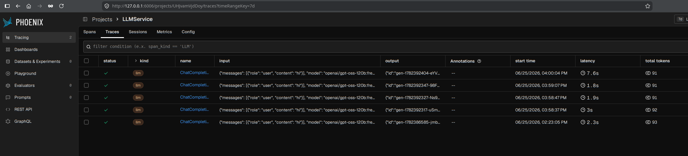

# Блок 3.5 — Observability ИИ-приложений
---
## [Репозиторий с работой](https://github.com/DimOsSpb/AI-Dev-Diploma/tree/v0.3.6)
## Результаты
1. Build app image
```bash
(diploma) odv@matebook16s:~/project/MY/Netology-AI-Dev/Diploma$ docker buildx build -t llm-service:dev .
[+] Building 490.0s (23/23) FINISHED                                                                                                                                                                           docker:default
 => [internal] load build definition from Dockerfile                                                                                                                                                                     0.0s
 => => transferring dockerfile: 1.26kB                                                                                                                                                                                   0.0s
 => resolve image config for docker-image://docker.io/docker/dockerfile:1.7                                                                                                                                              0.9s
 => CACHED docker-image://docker.io/docker/dockerfile:1.7@sha256:a57df69d0ea827fb7266491f2813635de6f17269be881f696fbfdf2d83dda33e                                                                                        0.0s
 => => resolve docker.io/docker/dockerfile:1.7@sha256:a57df69d0ea827fb7266491f2813635de6f17269be881f696fbfdf2d83dda33e                                                                                                   0.0s
 => [internal] load metadata for docker.io/library/python:3.13-slim-bookworm                                                                                                                                             0.6s
 => [internal] load metadata for ghcr.io/astral-sh/uv:0.11.14                                                                                                                                                            0.4s
 => [internal] load .dockerignore                                                                                                                                                                                        0.0s
 => => transferring context: 541B                                                                                                                                                                                        0.0s
 => [base 1/3] FROM docker.io/library/python:3.13-slim-bookworm@sha256:fcbd8dfc2605ba7c2eca646846c5e892b2931e41f6227985154a596f26ab8ed7                                                                                  0.1s
 => => resolve docker.io/library/python:3.13-slim-bookworm@sha256:fcbd8dfc2605ba7c2eca646846c5e892b2931e41f6227985154a596f26ab8ed7                                                                                       0.1s
 => FROM ghcr.io/astral-sh/uv:0.11.14@sha256:1025398289b62de8269e70c45b91ffa37c373f38118d7da036fb8bb8efc85d97                                                                                                            0.1s
 => => resolve ghcr.io/astral-sh/uv:0.11.14@sha256:1025398289b62de8269e70c45b91ffa37c373f38118d7da036fb8bb8efc85d97                                                                                                      0.1s
 => CACHED [base 2/3] WORKDIR /app                                                                                                                                                                                       0.0s
 => CACHED [base 3/3] COPY --from=ghcr.io/astral-sh/uv:0.11.14 /uv /uvx /bin/                                                                                                                                            0.0s
 => CACHED [runtime 1/4] RUN useradd --create-home --uid 1000 appuser                                                                                                                                                    0.0s
 => [runtime 2/4] WORKDIR /app                                                                                                                                                                                           0.1s
 => [internal] load build context                                                                                                                                                                                        0.2s
 => => transferring context: 330.05kB                                                                                                                                                                                    0.1s
 => CACHED [deps 1/2] COPY pyproject.toml uv.lock ./                                                                                                                                                                     0.0s
 => [build 1/1] COPY app/ ./app/                                                                                                                                                                                         0.1s
 => [deps 2/2] RUN --mount=type=cache,target=/root/.cache/uv     uv sync --frozen --no-dev                                                                                                                               2.4s
 => [runtime 3/4] COPY --from=deps /app/.venv /app/.venv                                                                                                                                                               157.6s
 => CACHED [deps 1/2] COPY pyproject.toml uv.lock ./                                                                                                                                                                     0.0s
 => CACHED [deps 2/2] RUN --mount=type=cache,target=/root/.cache/uv     uv sync --frozen --no-dev                                                                                                                        0.0s
 => CACHED [runtime 3/4] COPY --from=deps /app/.venv /app/.venv                                                                                                                                                          0.0s
 => CACHED [build 1/1] COPY app/ ./app/                                                                                                                                                                                  0.0s
 => [runtime 4/4] COPY --from=build /app/app /app/app                                                                                                                                                                    0.6s
 => exporting to image                                                                                                                                                                                                 214.0s
 => => exporting layers                                                                                                                                                                                                197.9s
 => => exporting manifest sha256:2a7a725f3276225574c1bac5b290842341bf83d56dfc3f5371e9999a8218e2d7                                                                                                                        0.0s
 => => exporting config sha256:5a22c315659b99e039b7c3e3a28e0c82649cc8839cb5bde7ac58eae89e6c3d92                                                                                                                          0.0s
 => => exporting attestation manifest sha256:ab635f16c4f8f2f053dd374312360c243188644490d7c213192bbc34cc91b7d5                                                                                                            0.1s
 => => exporting manifest list sha256:cb47430eb02b7f417758b923e28a9590b94cf2db463b70f94a383446c59477a8                                                                                                                   0.0s
 => => naming to docker.io/library/llm-service:dev                                                                                                                                                                       0.0s
 => => unpacking to docker.io/library/llm-service:dev                                                                                                                                                                   15.8s
(diploma) odv@matebook16s:~/project/MY/Netology-AI-Dev/Diploma$ docker images
                                                                                                                                                                                                          i Info →   U  In Use
IMAGE                         ID             DISK USAGE   CONTENT SIZE   EXTRA
arizephoenix/phoenix:latest   3a82885cd072       1.42GB          324MB
llm-service:dev               cb47430eb02b       1.17GB          271MB
redis:7.4-alpine              6ab0b6e73817       57.8MB         16.8MB
```
2. App UP
```bash
(diploma) odv@matebook16s:~/project/MY/Netology-AI-Dev/Diploma$ docker compose up -d
[+] up 3/3
 ✔ Container llm-redis   Healthy                                                                                                                                                                                          0.6s
 ✔ Container llm-phoenix Healthy                                                                                                                                                                                          0.6s
 ✔ Container llm-service Running                                                                                                                                                                                          0.0s
(diploma) odv@matebook16s:~/project/MY/Netology-AI-Dev/Diploma$ docker ps
CONTAINER ID   IMAGE                         COMMAND                  CREATED         STATUS                   PORTS                                                                                                NAMES
853deead3d5b   llm-service:dev               "uvicorn app.main:ap…"   3 minutes ago   Up 2 minutes (healthy)   0.0.0.0:8000->8000/tcp, [::]:8000->8000/tcp                                                          llm-service
34e4fca297f8   arizephoenix/phoenix:latest   "/usr/bin/python3.13…"   3 minutes ago   Up 3 minutes (healthy)   0.0.0.0:4317->4317/tcp, [::]:4317->4317/tcp, 0.0.0.0:6006->6006/tcp, [::]:6006->6006/tcp, 9090/tcp   llm-phoenix
98cc781e7622   redis:7.4-alpine              "docker-entrypoint.s…"   3 minutes ago   Up 3 minutes (healthy)   6379/tcp                                                                                             llm-redis
(diploma) odv@matebook16s:~/project/MY/Netology-AI-Dev/Diploma$ docker ps
CONTAINER ID   IMAGE                         COMMAND                  CREATED         STATUS                   PORTS                                                                                                NAMES
853deead3d5b   llm-service:dev               "uvicorn app.main:ap…"   4 minutes ago   Up 3 minutes (healthy)   0.0.0.0:8000->8000/tcp, [::]:8000->8000/tcp                                                          llm-service
34e4fca297f8   arizephoenix/phoenix:latest   "/usr/bin/python3.13…"   4 minutes ago   Up 4 minutes (healthy)   0.0.0.0:4317->4317/tcp, [::]:4317->4317/tcp, 0.0.0.0:6006->6006/tcp, [::]:6006->6006/tcp, 9090/tcp   llm-phoenix
98cc781e7622   redis:7.4-alpine              "docker-entrypoint.s…"   4 minutes ago   Up 4 minutes (healthy)   6379/tcp
```
3. UI Phoenix / трейсы LLM-запроса 



4. Logs
```bash
2026-06-25 14:17:50,672 | INFO | httpx | HTTP Request: POST https://openrouter.ai/api/v1/chat/completions "HTTP/1.1 200 OK"
{"model": "openai/gpt-oss-120b:free", "input_tokens": 68, "output_tokens": 23, "latency_ms": 2700.88, "finish_reason": "stop", "prompt_hash": "sha256:8f434346648f6b96", "prompt_preview": "hi", "event": "llm_request_completed", "path": "/chat", "request_id": "11d6415c667e452eb68fcb5374b4bdaf", "method": "POST", "level": "info", "timestamp": "2026-06-25T14:17:52.587006Z"}
INFO:     172.16.30.101:34820 - "POST /chat HTTP/1.1" 200 OK
2026-06-25 14:17:52,587 | INFO | app | request request_id=11d6415c667e452eb68fcb5374b4bdaf method=POST path=/chat status=200
```
5. Tests
```bash
(diploma) odv@matebook16s:~/project/MY/Netology-AI-Dev/Diploma$ pytest -s
==================================================================================================== test session starts =====================================================================================================
platform linux -- Python 3.13.5, pytest-9.1.1, pluggy-1.6.0
rootdir: /home/odv/project/MY/Netology-AI-Dev/Diploma
configfile: pyproject.toml
testpaths: tests
plugins: anyio-4.14.0, asyncio-1.4.0
asyncio: mode=Mode.AUTO, debug=False, asyncio_default_fixture_loop_scope=None, asyncio_default_test_loop_scope=function
collected 1 item

tests/test_pii.py
Test value = Мой e-mail: + ivan@mail.ru | ivan.a.s@mail-1.com; тел. + +7 (999) 123-45-67 | +79991234567 | 8 999 123 45 67 | 8(999)1234567; карта + 4111 1111 1111 1111 | 4111111111111111
Result = Мой e-mail: + [EMAIL] | [EMAIL]; тел. + [PHONE_RU] | [PHONE_RU] | [PHONE_RU] | [PHONE_RU]; карта + [CARD] | [CARD]
.

===================================================================================================== 1 passed in 0.05s ======================================================================================================
```
