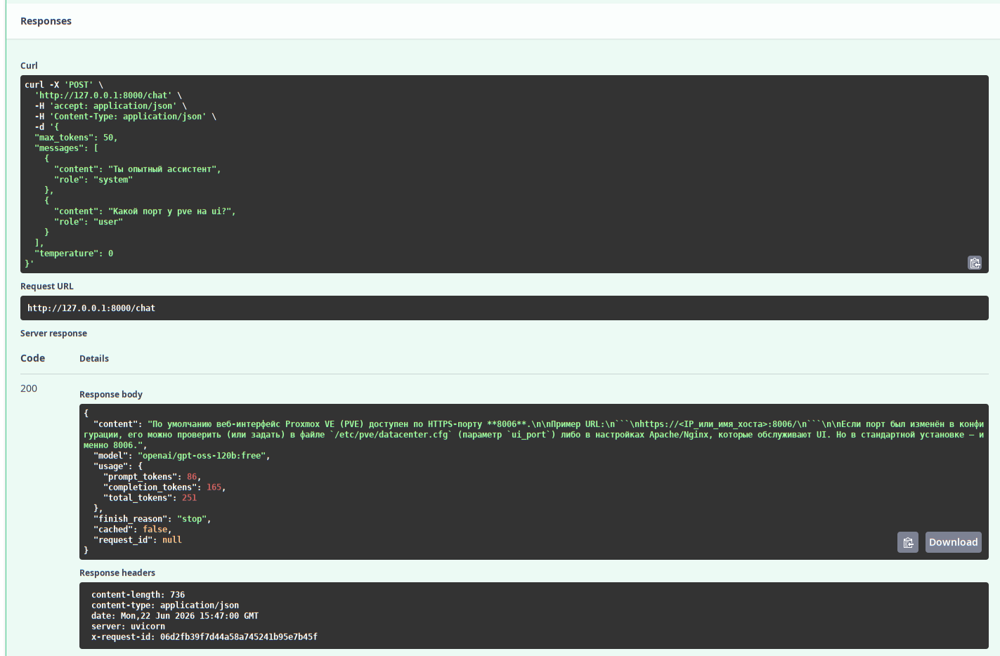

# Блок 3.4 — FastAPI-сервис для LLM
---
## [Репозиторий с работой](https://github.com/DimOsSpb/AI-Dev-Diploma/blob/af67bf3cd839f2d5cf7341480b8cd3c94bba6d79/README.md)
## Результаты
### Критерии самопроверки
1. uvicorn
```bash
odv@matebook16s:~/project/MY/Netology-AI-Dev/Diploma$ uv run uvicorn app.main:app --reload
INFO:     Will watch for changes in these directories: ['/home/odv/project/MY/Netology-AI-Dev/Diploma']
INFO:     Uvicorn running on http://127.0.0.1:8000 (Press CTRL+C to quit)
INFO:     Started reloader process [208646] using WatchFiles
INFO:     Started server process [208663]
INFO:     Waiting for application startup.
INFO:     Application startup complete.
```
```log
2026-06-22 17:30:20,501 | WARNING | LLMService | Redis недоступен (Error 111 connecting to localhost:6379. Connection refused.) — сервис работает без кеша
```
2. curl localhost:8000/chat
```bash
odv@matebook16s:~/project/MY/Netology-AI-Dev/Diploma$ curl -X POST localhost:8000/chat -H 'Content-Type: application/json' -d '{"messages":[{"role":"user","content":"hi"}]}'
{"content":"Hello! How can I help you today?","model":"openai/gpt-oss-120b:free","usage":{"prompt_tokens":68,"completion_tokens":23,"total_tokens":91},"finish_reason":"stop","cached":false,"request_id":null}
```
```log
2026-06-22 17:37:19,088 | INFO | httpx | HTTP Request: POST https://openrouter.ai/api/v1/chat/completions "HTTP/1.1 200 OK"
2026-06-22 17:37:21,180 | INFO | LLMService | request method=POST path=/chat status=200 duration_ms=7804.79 request_id=8d884d0d397845d981e90201f8775e7e
```
3. curl localhost:8000/chat/stream
```bash
:~/project/MY/Netology-AI-Dev/Diploma$ curl -N -X POSTcurl -N -X POST localhost:8000/chat/stream -H 'Content-Type: application/json'
-d '{"messages":[{"role":"user","content":"считай до пяти"}]}'
{"error":{"code":"validation_error","fields":[{"field":"","message":"Field required"}]}}bash: -d: команда не найдена
odv@matebook16s:~/project/MY/Netology-AI-Dev/Diploma$ curl -N -X POST localhost:8000/chat/stream -H 'Content-Type: application/json' -d '{"messages":[{"role":"user","content":"считай до пяти"}]}'
data: 1

data:


data: 2

data:


data: 3

data:


data: 4

data:


data: 5

data: {'usage': '{"prompt_tokens": 72, "completion_tokens": 45, "total_tokens": 117}'}

data: [DONE]
```
```uvicorn
INFO:     127.0.0.1:38470 - "POST /chat/stream HTTP/1.1" 422 Unprocessable Content
INFO:     127.0.0.1:40262 - "POST /chat/stream HTTP/1.1" 200 OK
```
```log
2026-06-22 17:43:00,234 | INFO | LLMService | request method=POST path=/chat/stream status=422 duration_ms=6.90 request_id=a02ae023a4e743cf86abaf9225f7b213
2026-06-22 17:43:15,103 | INFO | LLMService | request method=POST path=/chat/stream status=200 duration_ms=7.21 request_id=031419f48af545b49a5cab200dc9944c
2026-06-22 17:43:16,571 | INFO | httpx | HTTP Request: POST https://openrouter.ai/api/v1/chat/completions "HTTP/1.1 200 OK"
```
4. GET /health
```bash
odv@matebook16s:~/project/MY/Netology-AI-Dev/Diploma$ curl localhost:8000/health
{"status":"ok"}
```
```log
2026-06-22 17:49:07,493 | INFO | LLMService | request method=GET path=/health status=200 duration_ms=3.98 request_id=2c376208d0484ad397365eb4b7fdc0fb
```
5. Cache - Добавлена в POST "temperature":"0"!
```bash
odv@matebook16s:~/project/MY/Netology-AI-Dev/Diploma$ curl -X POST localhost:8000/chat -H 'Content-Type: application/json' -d '{"messages":[{"role":"user","content":"hi"}],"temperature":"0"}'
{"content":"Hello! How can I help you today?","model":"openai/gpt-oss-120b:free","usage":{"prompt_tokens":68,"completion_tokens":23,"total_tokens":91},"finish_reason":"stop","cached":false,"request_id":null}(diploma) odv@matebook16s:~/project/MY/Netology-AI-Dev/Diploma$ curl -X POST localhost:8000/chat -H 'Content-Type: application/json' -d '{"messages":[{"role":"user","content":"hi"}],"temperature":"0"}'
{"content":"Hello! How can I help you today?","model":"openai/gpt-oss-120b:free","usage":{"prompt_tokens":68,"completion_tokens":23,"total_tokens":91},"finish_reason":"stop","cached":true,"request_id":null}
```
```log
2026-06-22 18:40:33,412 | INFO | LLMService | request method=POST path=/chat status=200 duration_ms=4162.79 request_id=52bf9ac8215a4eafa3b162e427c8b1d5
2026-06-22 18:40:40,808 | INFO | LLMService | request method=POST path=/chat status=200 duration_ms=4.04 request_id=d0e3b1f62faf42648951f50d73a03fd6
```
6. /docs открывается, у POST /chat показывается пример запроса; «Try it out» -> 200


